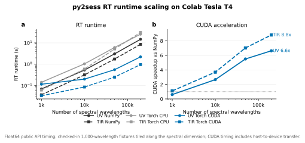

# Full-Spectrum Benchmarks

Runtime path:

```text
profile text + scene YAML -> Python preprocessing -> py2sess RT inputs -> RT solve
```

Use saved gas cross-section NetCDF tables for full runs. Direct HITRAN line
processing is for offline table generation or small checks.

## Run

Compact checked-in cases:

```bash
PYTHONPATH=src python3 examples/benchmark_scene_full_spectrum.py \
  --profile benchmarks/uv_profile1/profile.csv \
  --scene benchmarks/uv_profile1/scene.yaml \
  --backend numpy \
  --require-python-generated-inputs

PYTHONPATH=src python3 examples/benchmark_scene_full_spectrum.py \
  --profile benchmarks/tir_profile1/profile.csv \
  --scene benchmarks/tir_profile1/scene.yaml \
  --backend numpy \
  --require-python-generated-inputs
```

The command reads `mode: solar` or `mode: thermal` from the scene YAML. UV and
TIR use the same API.

Local full-spectrum thread sweep:

```bash
UV_PROFILE=profile_uv.txt UV_SCENE=uv_scene.yaml \
TIR_PROFILE=profile_tir.txt TIR_SCENE=tir_scene.yaml \
BACKEND=numpy THREADS="1 2 4" \
scripts/run_full_benchmark_threads.sh
```

Useful environment variables: `BACKEND=numpy|torch|both`, `THREADS`,
`TORCH_DEVICE=cpu|cuda|mps`, `TORCH_DTYPE=float64|float32`, `LIMIT`,
`CHUNK_SIZE`, and `OUTPUT_LEVELS=1`.

Add `--component-timing` only when you need diagnostic NumPy FO/2S split
timing. The default benchmark reports public `scene.forward()` RT time.

## CUDA / Colab

Colab usually starts with a CUDA-enabled PyTorch build already installed. Clone
the repo and install py2sess without the `torch` extra so pip does not replace
Colab's PyTorch wheel:

```python
!git clone https://github.com/happysky19/py2sess.git
%cd py2sess
%pip install -e .
```

Check the runtime before benchmarking:

```python
import torch

print(torch.__version__, torch.version.cuda)
print(torch.cuda.is_available())
print(torch.cuda.get_device_name(0) if torch.cuda.is_available() else "no CUDA")
```

The benchmark CLI accepts `--torch-device cuda`:

```bash
PYTHONPATH=src python examples/benchmark_scene_full_spectrum.py \
  --profile benchmarks/uv_profile1/profile.csv \
  --scene benchmarks/uv_profile1/scene.yaml \
  --backend torch \
  --torch-device cuda \
  --torch-dtype float64 \
  --require-python-generated-inputs
```

The checked-in UV and TIR scenes contain 1,000 spectral wavelengths. Larger
scaling experiments either need larger scene tables or should explicitly tile
the prepared inputs along the spectral dimension. CUDA timings through the
public NumPy-input API include host-to-device tensor transfer; workflows that
keep tensors on GPU may time differently.

The reference Colab Tesla T4 result below was generated from
[`docs/assets/cuda_colab_t4_scaling.csv`](assets/cuda_colab_t4_scaling.csv)
with [`scripts/plot_cuda_colab_t4_scaling.py`](../scripts/plot_cuda_colab_t4_scaling.py).
The plotting script requires matplotlib. It is a reproducibility reference for
this environment, not a general performance guarantee.



## Inputs

Strict mode uses profile/scene inputs and rejects direct HITRAN runtime
opacity:

```yaml
opacity:
  gas_cross_sections:
    table3d: {path: gas_xsec.nc}
```

Profile-dependent aerosol loading belongs in the profile CSV. Reusable aerosol
optical properties belong in one NetCDF:

```csv
pressure_hpa,temperature_k,height_km,O3,dust_loading,smoke_loading
1000.0,290.0,0.0,3.0e-8,1.0,0.0
```

```yaml
opacity:
  aerosol:
    properties: aerosol_properties.nc
    loading_columns:
      dust_loading: dust
      smoke_loading: smoke
```

`*_loading` columns are dimensionless in these benchmark files. The NetCDF
`bulk_extinction` and `bulk_scattering` variables use units
`optical_depth_per_unit_loading`, so py2sess computes
`aerosol_tau[wave, layer] = sum_type loading[layer, type] * bulk[wave, type]`.
Profile-level loading is averaged to layers.

Create an exact local table for one profile:

```bash
PYTHONPATH=src python3 scripts/create_hitran_opacity_table.py gas_xsec.nc \
  --profile profile.txt --scene scene.yaml
```

HITRAN table generation currently supports `fwhm=0` only. Gaussian
convolution is not implemented. Saved gas tables use linear interpolation in
wavelength/wavenumber, pressure, and temperature, so the table grid must be
dense enough for the intended accuracy.

Reference output files are validation only. They must carry the spectral grid
used for comparison. UV references should include `wavelength_nm`; TIR
references should include `wavelength_nm` and may also include
`wavenumber_cm_inv` or `wavenumber_band_cm_inv`.

## Current Convergence

Local 1-thread clean scene-input runs against the packaged reference outputs:

| Case | Wavelengths | Max absolute difference | Max relative difference |
|---|---:|---:|---:|
| UV | 280000 | `8.737648e-09` | `4.707861e-03 %` |
| TIR | 200000 | `5.017868e-07` | `4.993298e-04 %` |

The UV comparison includes the corrected Python Rayleigh CO2 unit handling.
The original Fortran benchmark has a small Rayleigh optical-depth bug there, so
the remaining UV difference is expected and minor.

Timing is machine-dependent. For speed changes, compare `rt (s)` before and
after on the same inputs, backend, dtype, chunk size, and thread count.

Use `rt (s)` for solver speed claims. `load (s)`, `layer optical properties`,
`optical preprocessing`, `thermal source`, and any geometry setup are
preprocessing costs and are printed separately when present.
